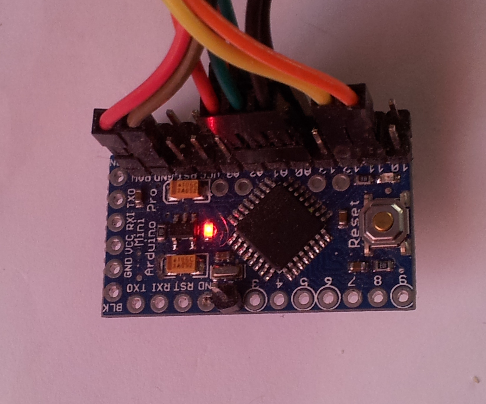
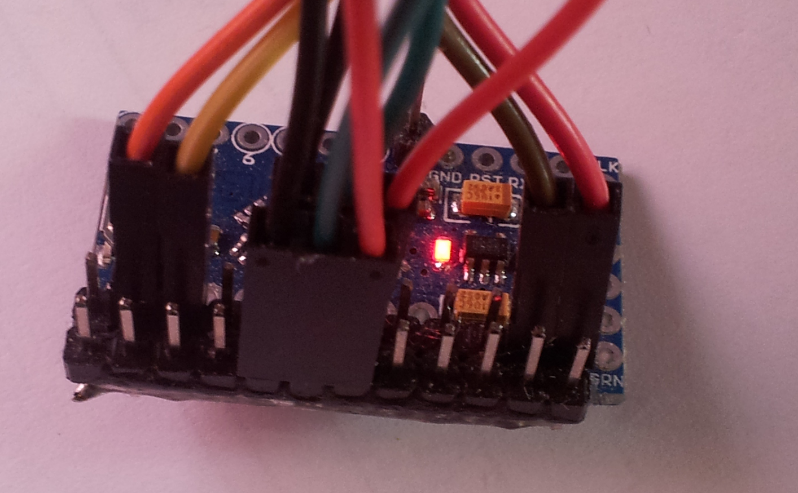
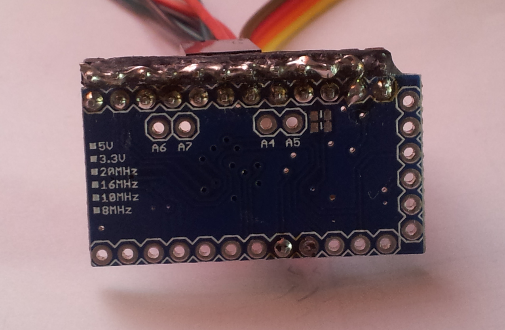

# FSR_ZProbe
My take on FSR Z-Probe for Marlin and Repetier

For Marlin and Repetier this looks just like a
mechanical switch that gives a high voltage (+5V)
when activated and 0V when not activated (or
vice versa if you chose to).

So the output from the Arduino board goes into
Z_MIN pin on RAMPS et al.

The hardware is a Arduino Pro Mini, 5V 16 MHz,
you are on your own if you only can use 3.3V (DUE), however
I intend to make a 3.3V version for the DUE.
To program it you need the usual USB to 6-Pin serial
converter. Ebay is full of them almost for free.

I simply soldered one row of connectors and glued
one more row of connectors side by side. The pins
on the extra connector are connected to ground.

## Shopping list

* Arduino Pro Mini 5V, 16 MHz (ebay)
* USB to 6-pin serial converter (ebay). For programming the Arduino Pro Mini
* 3 x Force Sensitive Resistor FSR402 (e.g. oomlout.co.uk and other places )
* 3 x Modified Bed holders adapted to the FSRs. An stl-model is here
* You may also need to modify your heated bed glass support
* Cables and connectors
* Arduino software: fsr.ino in this repsoitory
* Repetier 0.92 with my modifications for FSR

## Details of FSR, Arduino Pro Mini and Marlin/Repetier

Due to the nature of FSR - especially the resistance
drifting problematics - one can not set a "no contact"
reference resistance when starting the printer for the day
and let it be. Due to temperature variations, small shifts in 
bed position etc a reference resistance value will drift
over time.

Therefor, just before the measurement is to be made,
a resistance reference value is defined.
The Arduino need to known when this happens,
for this a signal is used to communicate
between Marlin/Repetier and the Arduino.
On RAMPS this is the "FSR_PIN", on Arduino
this is "PIN11".

### Arduino Pro Mini pin-out

Pin | Purpose
--- | ---
D12 | Goes HIGH at contact
D13 | Goes LOW at contact
D11 | Command-pin from Marlin/Repetier
A0  | FSR input
A1  | FSR input
A2  | FSR input
A3  | FSR input (make sure N_ADC is 4)
RAW | Enough voltage to drive the Arduino Pro Mini
GND | Ground

### Commands from Marlin/Repetier to Arduino Pro Mini

Number of 1-ms pulses defines as commands. Here is the list

Puls  | Command
--- | ---
1     | Define non-contact reference resistance
2     | Use insensitive contact value next contact
3     | Show the resistance threshold value using led blinks
4-99  | Set resistance threshold value (when contact)
100   | Same as 1 (But takes shorter time to send)
101   | Same as 2

With my modifications to Marlin/Repetier these commands
can easily be given by hand with "M40 Sn", if needed. 
Should not really be needed, but you may have to adjust
the senstivity of the sensor by changing the threshold value.

Commands are sent as pulses 1ms long and 1ms pause.
A 10ms period without puls means end of sending
command and start of command execution.

There you have it.
